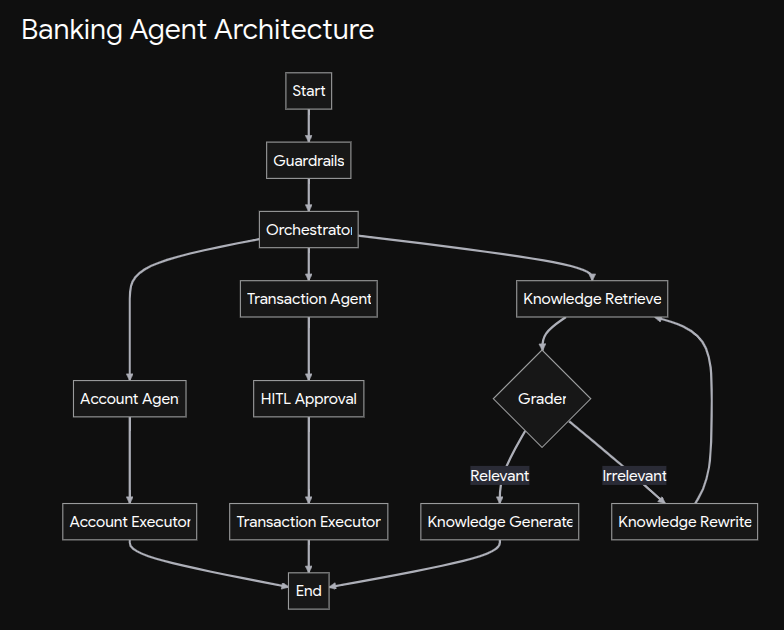

======================================================================================
                              1. USER INTERFACE TIER
======================================================================================
      [ Chat UI ]  <--------->  [ HITL Approval Dashboard (for Transfers) ]
           |
======================================================================================
                          2. LANGGRAPH MULTI-AGENT TIER (The Brain)
======================================================================================
           |
           ▼
  [ Input Guardrail Node ] (Strips PII, blocks prompt injections)
           |
           ▼
  [ Orchestrator Agent ] (GPT-4o: Triage & Routing)
           |
   ┌───────┼─────────────────────────────────────────────┐
   │       │                                             │
   ▼       ▼                                             ▼
[Account] [Transaction Agent]                      [Knowledge Agent]
[Agent  ]  (GPT-4o-mini)                            (GPT-4o)
           │                                             │
           ├─> HITL Interrupt (Wait for User)            ├─> [ Self-RAG Loop ]
           │                                             │   - Evaluate Relevance
           │                                             │   - Rewrite Query if failed
           │                                             │   - Generate Final Answer
           ▼                                             ▼
======================================================================================
                                (SSE Connection)
======================================================================================
                         3. FASTMCP SERVER TIER (The Brawn)
======================================================================================
   [ Tool Execution Layer ]                  [ Hybrid Knowledge Ingestion ]
   - create_new_account                      - PDF Loader -> Text Chunker
   - transfer_money                          - GraphExtractor (GPT-4o JSON Triples)
   - check_balance                           
   - search_bank_knowledge                   
           |                                             |
======================================================================================
                               4. DATA & STORAGE TIER
======================================================================================
   [ Transactional DB ]      [ Vector Store ]          [ Graph Store ]
   SQLite/PostgreSQL         ChromaDB (Embeddings)     NetworkX (graph.pkl)
   (Pydantic Schemas)        (Semantic Context)        (Logical Triples)

======================================================================================
                            5. OBSERVABILITY & EVALS TIER
======================================================================================
   - LangSmith (Visual graph tracing, token tracking, latency monitoring)
   - LLM-as-a-Judge Evals (Golden dataset testing for RAG accuracy before deployment)




- run the MCP server
```
uvicorn server:app
```
- run the fastapi langraph app server
```
uvicorn server:app --host 127.0.0.1 --port 8080 --reload
```
- run the ui
```
uv run streamlit run ui.py
```
- run phoenix
```
phoenix serve
python -m phoenix.server.main
```